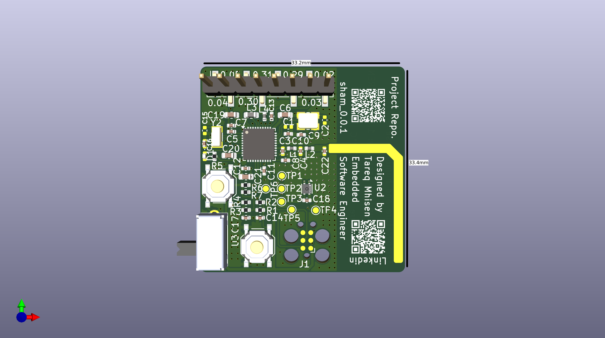
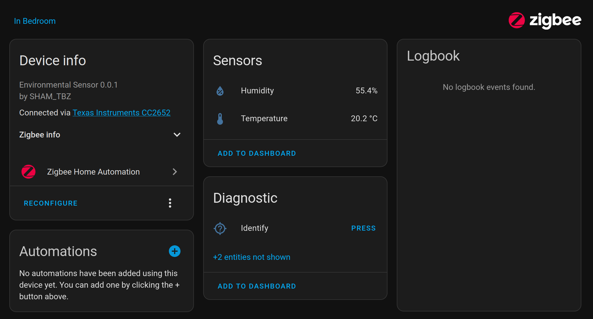

# 🌡️ Environmental Sensor - Zigbee & BLE IoT Device

## 📌 Overview

A **low-power, wireless temperature and humidity sensor** designed for seamless integration with **Zigbee networks and Home Assistant**. If you need a **smart way to monitor indoor conditions** and receive timely **reminders to improve air quality**, this customizable IoT sensor is the perfect solution.

Instead of purchasing a commercial device with limited customization, you can **build, modify, and tailor** this ultra-low-power sensor to suit your specific needs. In this project, I share the **design, source code, and hardware details**, giving you complete flexibility and control. 🚀  

---

## ⚡ Key Features

✅ **Ultra-low power consumption** – Uses only **10µA on average**, powered by a **CR2032 coin cell** for long-lasting performance.  
✅ **Reliable wireless communication** – Built around the **nRF52833** microcontroller with a **2.45 GHz PCB monopole antenna**, supporting both **BLE and Zigbee**.  
✅ **High-precision sensing** – Incorporates the **Sensirion SHT40 sensor** with an accuracy of **±0.2°C** and **±1.8% RH**.  
✅ **Two buttons** (reset and user-defined functions, currently set for factory reset).  
✅ **Status LED** for easy monitoring.  
✅ **Pin header** for debugging or external peripherals.  
✅ **Tag-Connect programming header** for effortless firmware updates.  



---

## 🔧 Firmware & Integration

### 📡 Zigbee Mode  

- Functions as a **Zigbee sleepy end device**, ensuring low power consumption and seamless integration into existing Zigbee networks and **Home Assistant**.  
- Built on **Zephyr RTOS**, providing a modular and expandable architecture.  
- Supports configurable **device ID, vendor settings, and measurement intervals (TBD)**.  
- Designed for easy expansion, allowing additional sensors (e.g., pressure, gas) with minimal code modifications.  

| Adding to Home Assistant | Sensor in Home Assistant |
|-------------------------|-------------------------|
|  |  |

### 📶 BLE Mode *(Upcoming Feature)*  

For those without a Zigbee network, a **BLE beacon firmware** will enable the device to act as a **Bluetooth Low Energy temperature and humidity sensor**, transmitting real-time data directly to a smartphone.

---

## 📢 Contribute & Customize

This project is designed for flexibilit whether you want to tweak the firmware, modify the hardware, or add new features, you are encouraged to contribute, suggest improvements, or fork the project to fit your specific needs.

Let's build smarter, more personalized environmental monitoring together! 🌍🔧

## Getting started

Before getting started, make sure you have a proper nRF Connect SDK development environment.
Follow the official
[Getting started guide](https://developer.nordicsemi.com/nRF_Connect_SDK/doc/latest/nrf/getting_started.html).

### Initialization

```shell
# Prepare workspace and virtual env
mkdir ws
python -m venv --copies ws/.venv
. ws/.venv/bin/activate
pip install west

# Initialize workspace
west init -m git@github.com:TAREQ-TBZ/env_sensor.git --mr main ws
cd ws
west update

# Install additional requirements
pip install -r zephyr/scripts/requirements.txt
pip install -r nrf/scripts/requirements.txt
pip install -r bootloader/mcuboot/scripts/requirements.txt
```

### Building and running

To build the main application, run the following command:

```shell
west build --sysbuild -b <YOURBOARD> application/app
```

To build the application for the sham_nrf52833 board

```shell
west build -b sham_nrf52833 application/app
```

To build the application for the nrf52840dk board with the overlay

```shell
west build -b nrf52840dk/nrf52840 application/app -DDTC_OVERLAY_FILE=../boards/arm/nrf52840dk_nrf52840.overlay
```

To flash the firmware:

```shell
west flash
```

## Building with vscode

Add the board folder and application to NRF Connect in your .vscode/settings.json

```json
{
    "nrf-connect.applications": [
        "${workspaceFolder}/application/app"
    ],
    "nrf-connect.boardRoots": [
        "${workspaceFolder}/application/"
    ]
}
```
