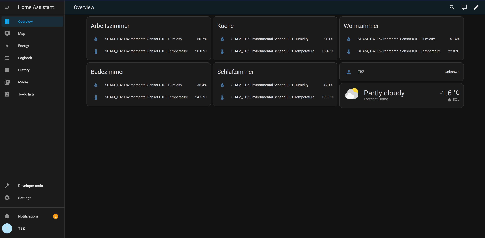

# 🌡️ Environmental Sensor - Zigbee Version

The BLE version can be found under: https://github.com/TAREQ-TBZ/ble_environmental_sensor

## ⚡ Key Features

✅ **Ultra-low power consumption** – Uses only **20µA on average**, powered by a **CR2032 coin cell** for long-lasting performance.  
✅ **Reliable wireless communication** – Built around the **nRF52833** microcontroller with a **2.45 GHz PCB monopole antenna**, supporting both **BLE and Zigbee**.  
✅ **Built on Zephyr RTOS**, providing a modular and expandable architecture.
✅ **Designed for easy expansion**, allowing additional sensors (e.g., pressure, gas) with minimal code modifications.  
✅ **High-precision sensing** – Incorporates the **Sensirion SHT40 sensor** with an accuracy of **±0.2°C** and **±1.8% RH**.  
✅ **Two buttons** (reset and user-defined functions, currently set for factory reset).  
✅ **Status LED** for easy monitoring.  
✅ **Pin header** for debugging or external peripherals.  
✅ **Tag-Connect programming header** for effortless firmware updates.  

| Board top side | Board bottom side |
|-------------------------|-------------------------|
|  |  |

---

## 🔧 Firmware & Integration

### 📡 Zigbee Mode  

- Functions as a **Zigbee sleepy end device**, ensuring low power consumption and seamless integration into existing Zigbee networks and **Home Assistant**.  
- Supports configurable **device ID, vendor settings, and measurement intervals (TBD)**.  

| Adding to Home Assistant | Overview in Home Assistant |
|-------------------------|-------------------------|
|  |  |

### 📶 BLE Mode *(Upcoming Feature)*  

For those without a Zigbee network, a **BLE firmware** will enable the device to act as a **Bluetooth Low Energy temperature and humidity sensor**, transmitting real-time data directly to a smartphone.

The BLE version can be found under: https://github.com/TAREQ-TBZ/ble_environmental_sensor

---

## 📢 Contribute & Customize

This project is designed for flexibility whether you want to tweak the firmware, modify the hardware, or add new features, you are encouraged to contribute, suggest improvements, or fork the project to fit your specific needs.

Let's build smarter, more personalized environmental monitoring together! 🌍🔧

## Getting started

Before getting started, make sure you have a proper nRF Connect SDK development environment.
Follow the official
[Getting started guide](https://developer.nordicsemi.com/nRF_Connect_SDK/doc/latest/nrf/getting_started.html).

### Initialization

```shell
# Prepare workspace and virtual env
mkdir ws
python -m venv --copies ws/.venv
. ws/.venv/bin/activate
pip install west

# Initialize workspace
west init -m git@github.com:TAREQ-TBZ/env_sensor.git --mr main ws
cd ws
west update

# Install additional requirements
pip install -r zephyr/scripts/requirements.txt
pip install -r nrf/scripts/requirements.txt
pip install -r bootloader/mcuboot/scripts/requirements.txt
```

### Building and running

To build the main application, run the following command:

```shell
west build --sysbuild -b <YOURBOARD> application/app
```

To build the application for the sham_nrf52833 board

```shell
west build -b sham_nrf52833 application/app
```

To flash the firmware:

```shell
west flash
```

## Building with vscode

Add the board folder and application to NRF Connect in your .vscode/settings.json

```json
{
    "nrf-connect.applications": [
        "${workspaceFolder}/application/app"
    ],
    "nrf-connect.boardRoots": [
        "${workspaceFolder}/application/"
    ]
}
```
